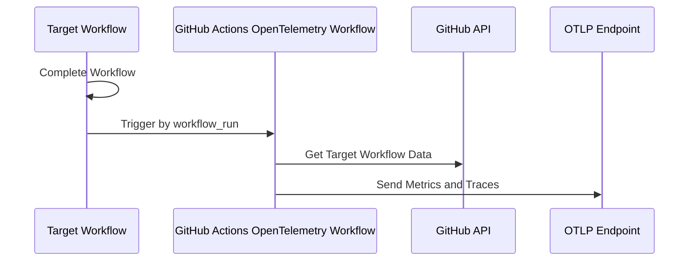

Update:

```
npm i
npm run package
# to check that build worked:
node dist/index.js
git push
```

Original README below:

---

# GitHub Actions OpenTelemetry


[](https://github.com/actions/typescript-action/actions/workflows/check-dist.yml)
[](https://github.com/actions/typescript-action/actions/workflows/codeql-analysis.yml)
[](./badges/coverage.svg)

This action sends metrics and traces of GitHub Actions to an OpenTelemetry
Protocol (OTLP) endpoint. It helps you monitor and analyze GitHub Actions.

## Features Summary

- 📊 Collects Metrics of GitHub Actions workflows and job execution times
- 🔍 Collects Traces of GitHub Actions workflow, jobs, steps.
- 📦 Sends data to any OTLP-compatible backend for monitoring and observability
- 🚀 Collect telemetry without modifying existing workflows

## Metrics

| Descriptor Name              | Description            |
| ---------------------------- | ---------------------- |
| `github.workflow.duration`   | Duration of workflow   |
| `github.job.duration`        | Duration of job        |
| `github.job.queued_duration` | Duration of queued job |

Each metric has associated attributes.


## Traces


Traces include several attributes to help identify and analyze workflow
execution:

- **Workflow-level attributes**: `run_id`, `run_attempt`, `repository`, `url`
- **Job-level attributes**: `job.id`, `job.conclusion`, `runner.name`,
  `runner.group`

You can find a trace by the `run_id` attribute attached to the root span.
`run_id` is visible in the workflow results URL. For example, if the URL is:

```txt
https://github.com/paper2/github-actions-opentelemetry/actions/runs/12246387114
```

Then the `run_id` is `12246387114`.

### Adding Custom Resource Attributes

You can add custom attributes to all traces and metrics using the
`OTEL_RESOURCE_ATTRIBUTES` environment variable. This is useful for adding
context like environment, or team information:

```yaml
env:
  OTEL_RESOURCE_ATTRIBUTES: 'environment=production,team=backend'
```

These custom attributes will be included as resource attributes in all exported
telemetry data.


## Trace ID Summary

After the action completes, you'll see the workflow trace ID displayed in the
GitHub Actions summary for easy access:


## How it works

This action creates metrics and traces of GitHub Actions workflows and sends
them to an OTLP endpoint. It uses the GitHub API to collect data about completed
workflows and jobs. The action then sends this data to the OTLP endpoint for
monitoring and observability.



## Setup Instructions

1. **Create OTLP Endpoint**: Set up an OTLP backend to receive telemetry data
   (e.g., Jaeger, Prometheus, or other monitoring tools).
1. **Add a Workflow**: Create a new workflow file and use this action triggered
   by
   [workflow_run](https://docs.github.com/en/actions/writing-workflows/choosing-when-your-workflow-runs/events-that-trigger-workflows#workflow_run)
   because this action collects telemetry of completed workflows.

### GitHub Actions Examples

#### Option 1: Monitor Other Workflows

Monitor completed workflows triggered by `workflow_run` events:

```yaml
name: Send Telemetry after Other Workflow

on:
  workflow_run:
    # Specify the workflows you want to collect telemetry.
    workflows:
      - Check Transpiled JavaScript
      - Continuous Integration
      - CodeQL
      - Lint Codebase
    # This action uses completed workflow for making traces and metrics.
    types:
      - completed

permissions:
  # Required for private repositories
  actions: read

jobs:
  send-telemetry:
    name: Send CI Telemetry
    runs-on: ubuntu-latest
    steps:
      - name: Run
        id: run
        uses: paper2/github-actions-opentelemetry@main
        env:
          OTEL_SERVICE_NAME: github-actions-opentelemetry
          OTEL_EXPORTER_OTLP_ENDPOINT: https://collector-example.com
          # Additional OTLP headers. Useful for OTLP authentication.
          # e.g.
          # New Relic: api-key=YOUR_NEWRELIC_API_KEY
          # Google Cloud Run: Authorization=Bearer <value of $(gcloud auth print-identity-token)>
          # Basic Authentication: Authorization=Basic <base64-encoded value of userid:password>
          OTEL_EXPORTER_OTLP_HEADERS:
            api-key=${ secrets.API_KEY },other-config-value=value
          OTEL_RESOURCE_ATTRIBUTES: 'environment=ci,team=backend'
        with:
          # Required for collecting workflow data
          GITHUB_TOKEN: ${{ secrets.GITHUB_TOKEN }}
```

#### Option 2: Monitor Current Workflow (Experimental)

Monitor the current workflow by running this action as the last step:

```yaml
name: CI with Built-in Telemetry

on:
  push:
    branches: [main]
  pull_request:
    branches: [main]

jobs:
  build:
    runs-on: ubuntu-latest
    steps:
      - uses: actions/checkout@v4
      - run: npm ci
      - run: npm run build

  test:
    runs-on: ubuntu-latest
    steps:
      - uses: actions/checkout@v4
      - run: npm ci
      - run: npm test

  # Telemetry job runs after all other jobs complete
  telemetry:
    runs-on: ubuntu-latest
    needs: [build, test] # Wait for other jobs to complete
    if: always() # Run even if other jobs fail
    steps:
      - name: Send Telemetry
        uses: paper2/github-actions-opentelemetry@main
        env:
          OTEL_SERVICE_NAME: github-actions-opentelemetry
          OTEL_EXPORTER_OTLP_ENDPOINT: https://collector-example.com
          # Additional OTLP headers. Useful for OTLP authentication.
          # e.g.
          # New Relic: api-key=YOUR_NEWRELIC_API_KEY
          # Google Cloud Run: Authorization=Bearer <value of $(gcloud auth print-identity-token)>
          # Basic Authentication: Authorization=Basic <base64-encoded value of userid:password>
          OTEL_EXPORTER_OTLP_HEADERS:
            api-key=${ secrets.API_KEY },other-config-value=value
          OTEL_RESOURCE_ATTRIBUTES: 'environment=ci,team=backend'
        with:
          GITHUB_TOKEN: ${{ secrets.GITHUB_TOKEN }}
```

### Configuration

To configure the action, you need to set the following environment variables:

| Environment Variable                  | Required | Default Value | Description                                                                                        |
| ------------------------------------- | -------- | ------------- | -------------------------------------------------------------------------------------------------- |
| `OTEL_SERVICE_NAME`                   | Yes      | -             | Service name.                                                                                      |
| `OTEL_EXPORTER_OTLP_ENDPOINT`         | Yes      | -             | OTLP Endpoint for Traces and Metrics. e.g., <https://collector-example.com>                        |
| `OTEL_EXPORTER_OTLP_METRICS_ENDPOINT` | No       | -             | OTLP Endpoint for Metrics instead of OTEL_EXPORTER_OTLP_ENDPOINT.                                  |
| `OTEL_EXPORTER_OTLP_TRACES_ENDPOINT`  | No       | -             | OTLP Endpoint for Traces instead of OTEL_EXPORTER_OTLP_ENDPOINT.                                   |
| `OTEL_EXPORTER_OTLP_HEADERS`          | No       | -             | Additional OTLP headers. Useful for authentication. e.g., "api-key=key,other-config-value=value"   |
| `OTEL_RESOURCE_ATTRIBUTES`            | No       | -             | Additional resource attributes for traces and metrics. e.g., "environment=production,team=backend" |
| `FEATURE_TRACE`                       | No       | `true`        | Enable trace feature.                                                                              |
| `FEATURE_METRICS`                     | No       | `true`        | Enable Metrics feature.                                                                            |
| `OTEL_LOG_LEVEL`                      | No       | `info`        | Log level.                                                                                         |

### Getting Started

We prepared a [Getting Started](./examples/google-cloud/README.md) to create
OpenTelemetry backend and run this action by using Google Cloud.

## Limitations

There are some limitations that come from GitHub Actions Specification. See
[Specification](https://github.com/paper2/github-actions-opentelemetry/wiki/Specification)
page for details.

## Development

### Dev Container

You can run containers by
[devcontainer](https://code.visualstudio.com/docs/devcontainers/containers).

- Jaeger and Prometheus run for local testing.
  - Jaeger: <http://localhost:16686>
  - Prometheus: <http://localhost:9090>

### Local test

You can run all tests below command.

```sh
npm run test
```

You can run a simple test. It is useful for checking output while developing.

```sh
npm run test-local
```

### Compile

TypeScript codes must be compiled by ncc. You have changed code, run bellow the
command.

```sh
npm run all
```

> [!NOTE]  
> This command creates `index.js` and more on the `/dist` directory. You must
> includes these artifacts on a commit because GitHub Actions uses these files.

### Recommend to install GitHub CLI (gh)

Tests invoke real GitHub API. Unauthenticated users are subject to strict API
rate limits. If `gh` command is installed and login is finished, token is
automatically set for tests by `vitest.config.ts`.

the login command is below.

```sh
gh auth login
```

If you face below error, recommend to install GitHub CLI and login.

```text
message: "API rate limit exceeded for xx.xx.xx.xx. (But here's the good news: Authenticated requests get a higher rate limit. Check out the documentation for more details.)",
documentation_url: 'https://docs.github.com/rest/overview/resources-in-the-rest-api#rate-limiting'
```

### Default Environment Variables for Testing

Some environment variables are set on `vitest.config.ts`.

## License

This project is licensed under the MIT License. See the [LICENSE](./LICENSE)
file for details.

## Contributing

Contributions are welcome! Please fork the repository and submit a pull request.
Before contributing, ensure that your changes are well-documented and tested.

## Support

If you encounter any issues or have questions, feel free to open an issue in the
repository. We will do our best to assist you promptly.
